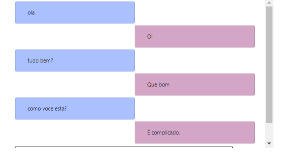

# ChatBot-Django
ChatBot with Python and Django.
## Instructions:
* Download the project
* Install the required libs
* Access the digits folder and run the command: python manage.py runserver
* Access localhost at /chatbot/bot/

